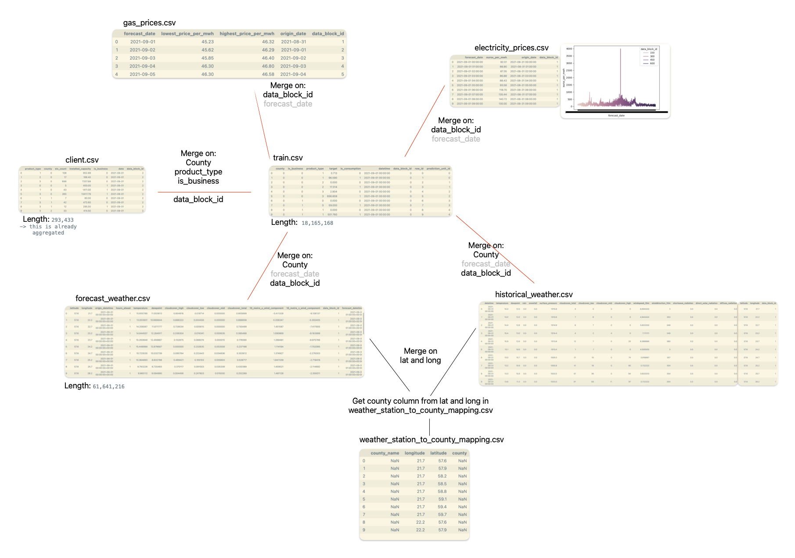
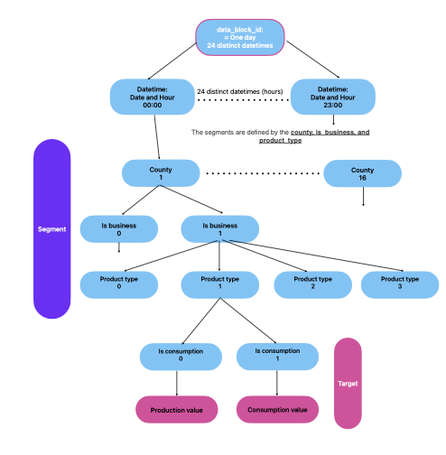
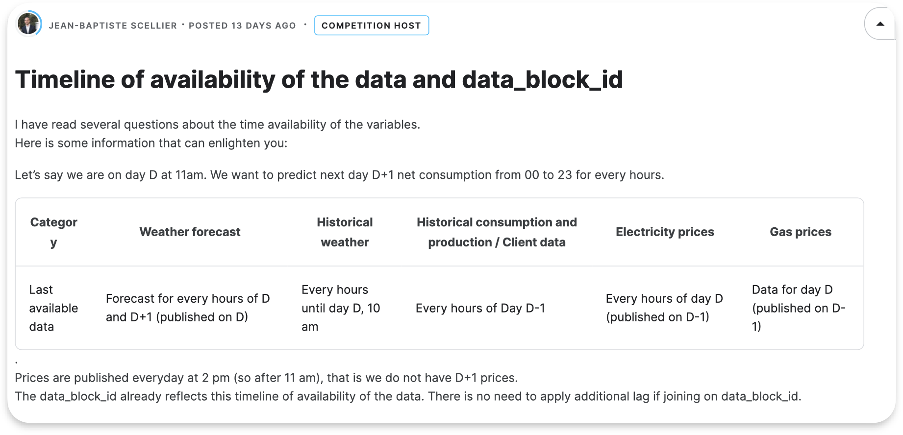

# Capstone Enefit
## Basic info
* [Project](https://www.kaggle.com/competitions/predict-energy-behavior-of-prosumers/overview)
* [Kanban Board](https://github.com/users/VadymKhvoinytskyi/projects/1/views/1)
* [Milestones](https://github.com/VadymKhvoinytskyi/Enefit-capstone-project/milestones?with_issues=no)

# Reports to Coaches
## 8.12.23
* We have to create a prediction model of prosumers to reduce energy imbalance costs
* Submission:
  * test: county,is_business,product_type,is_consumption,prediction_datetime,data_block_id,row_id,prediction_unit_id,currently_scored
  * prediction: row_id,data_block_id,target
* Q: How relevant are time series for our case?
* Ask coaches for time series recording

# Logbook

## 14.12.
### Notes from today

- Tweaked model parameters again
- “Pickled” the best model
- Further development:
    - drop columns
    - Bring train-test MAE closer to each other
- Modelling test notebook was added (Trying out our model on “real” test csv):
    - First merging
    - Data preparation
    - The running the model
- API exploration

Ask the coaches:
- Holidays: Already starts on the 20st? double check if we meet for screenshot or not
- Midterm presentation: is it google slides? Or just notebooks leading through
- Timeseries: general opinion on the model from Nico
- Is it possible we have good result XGBoost but it’s too good, we should switch to timeseries?
- Null values

## 13.12.
### Notes from today

Null values:
- null values? are they affecting our model? Vanessa checked some modifications: slight differences
- options to fill these values? with other counties results? aggregation by block ID and hour?
- let's agree on how to handle them

Parameters tuning:
- similar results with grid search parameters when production/consumption is split into 2 and when not
- multi-output models?
- oversampling 2023? 

To do tomorrow:
- writing functions: to merge, to model
- checking our model on test data and then see results

Open questions (Vanessa):
- can XGBoost handle NaN values? Do we have to handle them before modelling?
-> by defaulf, XGBoost can handle null values (but for linear model)

- what parameters can we tune? (see Modelling notebook)
https://xgboost.readthedocs.io/en/stable/parameter.html

- what other features can/should we remove?
    - none?

## 12.12.
### Plan for today
  - residuals further checking
  - continue from yesterday
  - trend about high capacity
  - feature importance

### Notes from today
- investigating residuals' trends
- splitting EDA, Merging and Modeling notebooks
- merged csv will be saved on harddrive 
- normalization: not needed because of xpgboost includes
- we started checking feature importances, and removing features
- dummies are not needed, xgboost can handle them. But we need to set them to categorical variables.
- feature engineering:
  - workday vs weekend
  - holidays
  - increasing in the capacity
  - weather aggregation for previous/future period
  - prices aggregation for previous period

## 11.12.
### Plan for today
- Edit:
  - continue working on the model
  - checking model parameters and try out different values
- Claude: 
    - there is an error in a plot, lets correct
    - Cleanup notebook
    - Why do we have good results?
    - Test vs train results should be equal, it seems to be an overfit
- Vanessa:
    - Why the modell fitting so well on train data
- Sarah:
    - Same
    - Train-test split change caused lots of changes
    - Split up tasks, work individually
- Vadim:
    - Continue on the model
    - Eliminate features
    - Model tweaking and changing parameters
    - Feature engineering

### Notes from today
- checking residuals
- remove unnecessary features
- trend effect removal?
- normalization?
- model tweaking

## NEXT 11.12.23
### Plan for today / the week
* visualisation
* split by date
* tweaking the parameters
* drop some features
* feature engineering
* overfitting with traditional train_test_split?
* try to models/ multiple_output/ other models

### Notes from today

## 8.12.
### Plan for today
* Finish baseline model and incoporate contribution from team into notebook
* Work on first "real" model

### Notes from today
* Consumption can be well described by our baseline model
* Production cannot not be so well described by baseline model

## 7.12.
### Plan for today
* Edit 
  * Individual thinking + Hypothesis
* Vanessa Plan about baseline model (what to do).
  * Forums: not a lot on time series (consumption amount can be seen as time series)
  * Prediction rather not a time series
  * [Statsistics on Estonia](https://tamm.stat.ee/?lang=en)
* Sarah
  * Hypothesis in the group or sub groups
* Clean roadmap and prepare reporting for Friday to coaches
* Gather charts from yesterday (via Slack if not working otherwise)
* MAIN TOPICS
  * First hypotheses prepared? If not: Split individually or as group
  * Decide:
    * further EDA based on hypotheses needed?
    * OR: feature engineering
  * First model
* Gather topics to bring forward to coaches
  
### Notes from today
* Put graphs from the group contribution to the notebook
* Cleaned notebook
* First baseline model (new dataframe wihch dates back data 365 days)

## 6.12.23 
### Plan for today
* Continue looking at gaps in data
* Brainstorm and implement (basic) feature engineering
* Continue on visualisation where needed to ...
* ... Start EDA and write down GOALS first ('research questions) -> baseline model'

### Notes from today
* We did some individual plots, nothing unexpected emerged apart from a few "anomylities" (e.g. energy consumption rose for the second year - see notebook)
* Unclear what next step would be and if we work as group or individualls
* Discussed: Can we exclude the non-businesses from data to more easily analyse trend (idea: smaller producers have less capacity, not influencing as much)? Conclusion controverse: So many are non-business... Maybe coming back to it later. Additional thought: How much is the _capacity_ linfluencing the _target_.
* EDA notebook cleaned up

## 4./5.23
lectures on Agile and Time Series

### Analysing data gaps
* At least county ID 12 seems to be problematic
* datablock IDs 0, 1 were problemeatic
* First visualisations -> assumption: businesses (is_business == 1) produce more energy

## 1.12.23 
### Plan for today
* Continue working on merge
### Notes from today
* Please refer to EDA notebook comments, they show each step what has been done:)
- Merging: train data with everything else

- Merging electricity & gas prices:
    - On date time, data_block_id
    - But prices are hourly prices, so we split date time to hours first

- Merging historical & forecast weather data
    - merge counties first
    - Aggregate duplicate locations
    - Time of day switch

- Correcting the timezone of forecast_time (from UTC to EET)
- Organising comments and notes in the notebook
- Plans for Monday: further brainstorm on feature engineering and start with data cleaning & EDA
* 

## 30.11.23
### Plan for today
Merge data (in group) - and/or quick EDA on individual tables (subgroups/individual)?

* Data Block ID 0 abd 1 have no corresponding entries in train

## 29.11.23 - Getting to know the data structure
* Mainly discussed when data is gathered for prediction and how the relate to each other
* Assumption: data will be merged/circle around data_block_id, because those data blocks take in to account that certain data availability is lagging (via API). [See details here](https://www.kaggle.com/competitions/predict-energy-behavior-of-prosumers/discussion/455833) and [here](https://www.kaggle.com/competitions/predict-energy-behavior-of-prosumers/discussion/455100).
* Alternative idea is to merge on client.csv and forecast dates, but potentially this brings the problem of lagging (see above) back into play
* Consumption and Production is held in separate columns. Unclear yet if we would have different models for consumption / production prediction. But in message from [host](https://www.kaggle.com/competitions/predict-energy-behavior-of-prosumers/discussion/455833) it asks about net consumption, so that might not be way to go.

